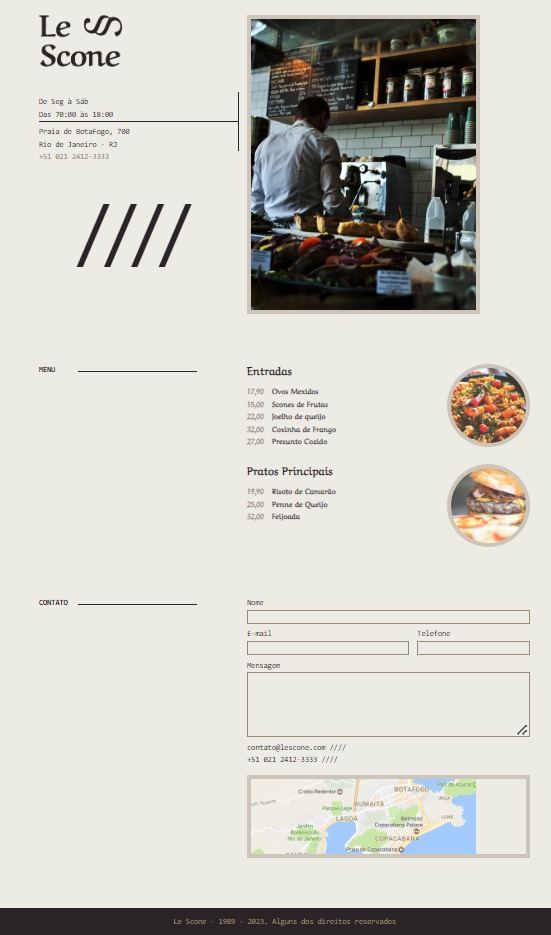

# Le Scone - Projeto SASS

Aplicação da ferramenta SASS na criação de um site de Menu para uma cafeteria, projeto onde todo o CSS foi criado de acordo com o SASS.

## Tabela de Conteúdo

- [Projeto](#Projeto)
  - [Screenshot](#screenshot)
  - [Links](#links)

### Projeto

No projeto foram aplicados vários detahes para aprender o uso do SASS, mixins, funções, loops e variáveis entre outras ferramentas para trazer maior otimização da consrtução do CSS através do SASS.

### Links

- Live Site URL: [Add live site URL here](https://kelf1729.github.io/LeScone_SASS/)

### Screenshot

